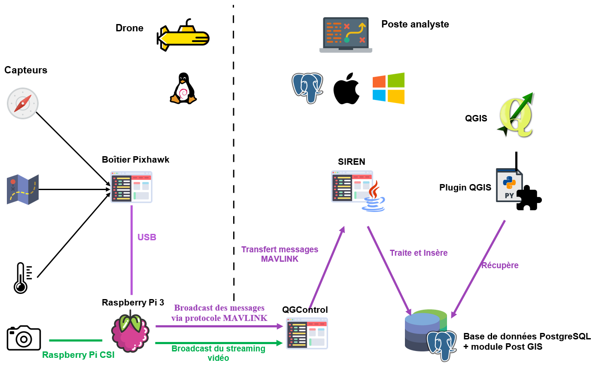
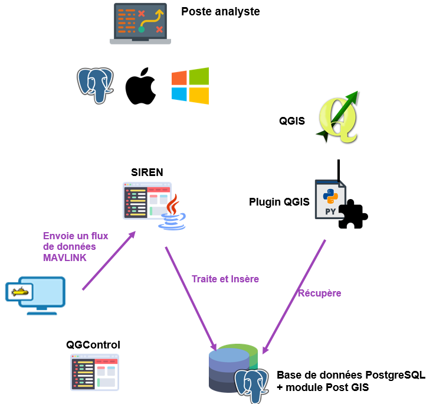
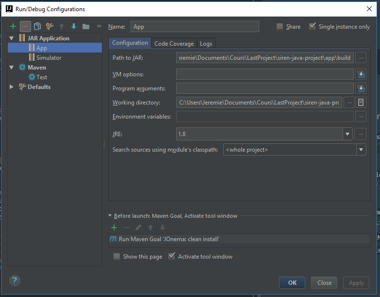
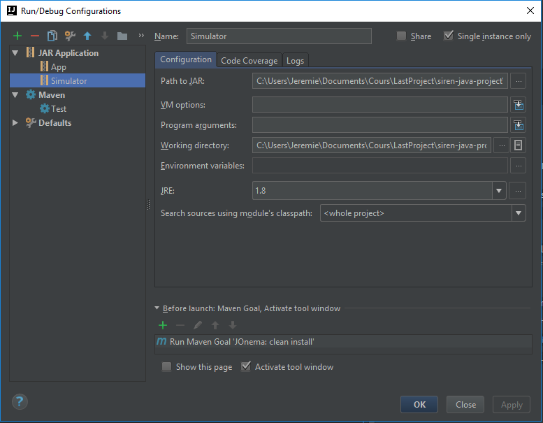
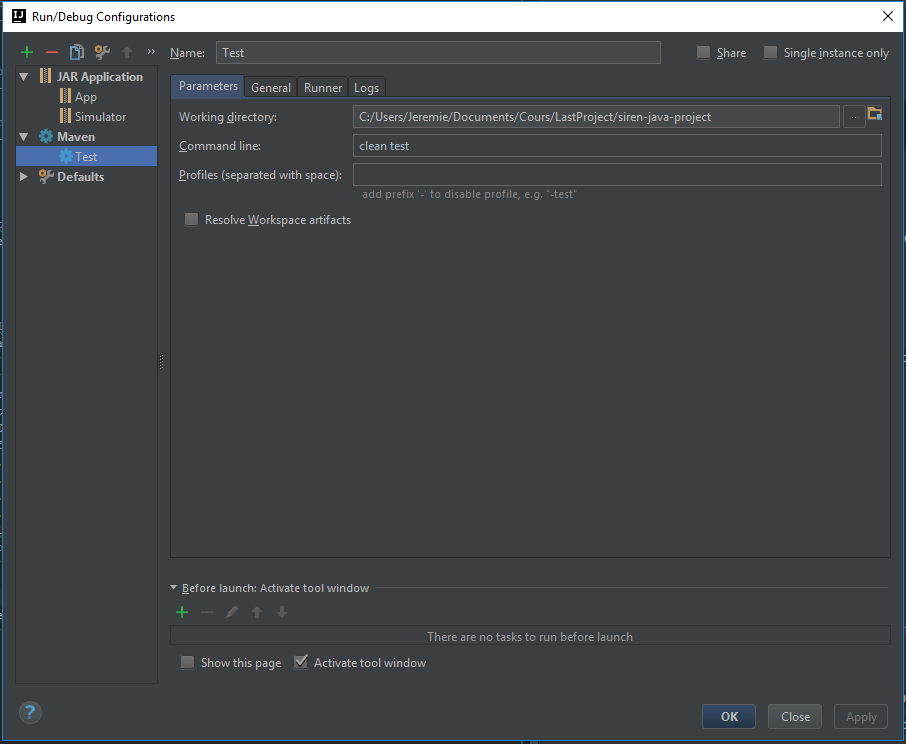

# Projet de développement de SIREN

## Description
Projet SIREN représentant une application JAVA permettant de positionner un drone sous-marin avec une précision de 50cm.
Le positionnement est stocké dans la base de données pour que celui-ci puisse ensuite être affiché dans QGIS.

## Architecture
- app
    > Centre de l'application. Cette partie représente la totalité du projet au niveau de l'interface graphique.
- lib
    > Coeur logique de l'application. Cette partie représente toute la partie librairie du projet. La librairie est utilisée par ```app``` et ```simulator```.
- simulator
    > Simulateur du drone. Cette partie représente la totalité de l'interface en ligne de commande du simulateur.

Architecture de SIREN

Architecture du Simulateur
   
   
## Compilation et Exécution
### Compilation
Pour générer les JARs :
```
mvn clean install
```

Les jars sont stockés dans :
```
|--siren-java-project
    |--app
    |   |--build
    |       |--app-1.0.jar                       # JAR SIREN sans dépendances
    |       |--app-1.0-jar-with-dependencies.jar # JAR SIREN avec dépendances
    |--lib
    |   |--build
    |       |--lib-1.0.jar                       # JAR de la librairie (pour les dépendances)
    |--simulator
        |--build
            |--simulator-1.0.jar                       # JAR Simulateur sans dépendances
            |--simulator-1.0-jar-with-dependencies.jar # JAR Simulateur avec dépendances
```

### Exécution
Pour lancer un JAR :
```
java -jar $nomDuJAR
```

### IntelliJ IDEA
La compilation et l'exécution dans IntelliJ IDEA requiert un paramétrage particulier.
1. ```Run``` > ```Edit Configurations...```
2. ```Add``` (+) > ```JAR Application```
    1. Name : ```App```
    2. Path to JAR : ```app/build/app-1.0-jar-with-dependencies.jar```
    3. JRE : ```1.8``` (JRE relatif à Java 8)
    4. Before Launch :
        1. Supprimer via ```Remove``` (-) toutes les entrées
        2. Ajouter via ```Add``` (+)
        3. Sélectionner ```Run Maven goal```
        4. Saisissez ```clean install```
    5. Valider
3.  ```App``` en haut à droite
4. ```Run``` (>) en haut à droite


Même chose à réaliser pour l'exécution du simulateur avec les paramètres suivants :
- Name : ```Simulator```
- Path to JAR : ```simulator/build/simulator-1.0-jar-with-dependencies.jar```
- Pour le lancement (étape 3), choisir ```Simulator``` au lieu de ```App```


App

Simulator


## Tests
Pour lancer les tests, il faut exécuter la commande suivante :
```
mvn clean test
```

Dans IntelliJ IDEA, il faut réaliser quelques manipulations :
1. ```Run``` > ```Edit Configurations...```
2. ```Add``` (+) > ```Maven```
    1. Name : ```Test```
    2. Working directory: ```siren-java-project``` (Chemin complet du répertoire racine du projet)
    3. Command line: ```clean test```
3.  ```Test``` en haut à droite
4. ```Run``` (>) en haut à droite




## Dépendances
Les dépendances sont gérées par Maven :
- ```JUnit:4.12``` (pour les tests uniquement)
- ```commons-cli:1.3.1```
- ```postgresql:9.4.1212```